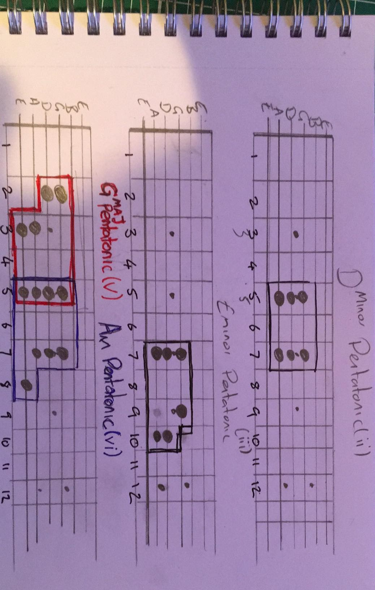

# Tunes

## Ash's picks

- [Body Beat: Soca-Dub and Electronic Calypso (1979-98)](https://soundwayrecords.bandcamp.com/album/body-beat-soca-dub-and-electronic-calypso-1979-98)
- [Frente Cumbiero: Porrovia](https://frentecumbiero.bandcamp.com/track/porrov-a)
- [Meridian Brothers / Conjunto Media Luna: Paz En La Tierra](https://meridianbrothers.bandcamp.com/album/paz-en-la-tierra)
- https://themauskovicdanceband.bandcamp.com/album/its-all-mauskovic-7-single
- https://romperayo.bandcamp.com/album/romperayo-descargas-pintorescas
- https://youtu.be/86SyRKRzOmE
- https://romperayo.bandcamp.com/track/insurgentes-carism-ticos-llegaron-los-burros

## Simon's picks

- [S.E. Rojie: Fire Fire](https://www.youtube.com/watch?v=ImPsBiFLzKs)
- [D.O. Misiani & Shirati Jazz: Kiseru](https://www.youtube.com/watch?v=uK0VJYEI32I)

# Theory

# Tech

- [Buchla Low Pass Gate](https://www.youtube.com/watch?v=NGz3dDnoVVk)

# Art

- https://www.facebook.com/kalie.kismet/posts/10223008647558447

